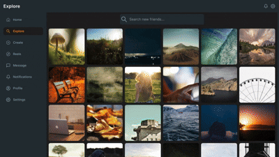

# FriendLink — Full Stack Social Media Application

FriendLink is a modern, scalable social media platform that allows users to connect, share moments, and engage in real-time.

This repository contains both the **Frontend (Client)** and **Backend (Server)** of the application.

---

## 🚀 Features

- Secure Authentication (JWT)
- User Profiles & Follow System
- Create, Edit & Delete Posts (Moments)
- Like, Comment & Reply System
- Infinite Scroll Feeds (Feeds / Explore / Trending)
- Media Upload & Management
- Real-time UI Updates
- Theme Toggle (Light / Dark)
- Responsive UI (Mobile & Desktop)
- Admin & Analytics APIs

---

## 🏗 Tech Stack

### Frontend

- React + Vite
- Tailwind CSS
- Axios
- React Router

### Backend

- Node.js
- Express.js
- MySQL
- JWT, Bcrypt, Multer

---

## 📁 Project Structure

```bash
friendlink/
├── client/   # React Frontend
├── demo/     # Application UI Images / Demo GIFs
├── server/   # Node.js + Express API
└── README.md
```

## 🗄 Database

- MySQL with relational schema
- Optimized indexes & triggers
- Auto-updated counts (likes, comments, followers)

## 🎬 App Demo



---

## 🙋‍♂️ Author

**Ankit Raj**

- 📫 [contact@rajankit.in](mailto:contact@rajankit.in)
- 🐙 [GitHub](https://github.com/ankitraj217)
- 💼 [LinkedIn](https://linkedin.com/in/ankitraj217)

---

## ⭐ If you like this project, don’t forget to star the repository!
